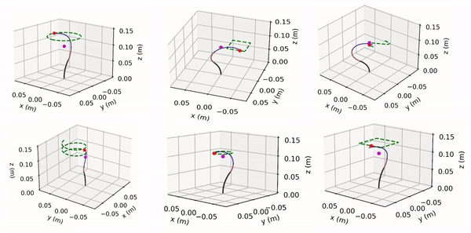

#   A Synergistic Framework for Learning Shape Estimation and Shape-Aware Whole-Body Control Policy for Continuum Robots
In this work, we present a novel synergistic framework for learning shape estimation and a shape-aware whole-body control policy for tendon driven continuum robots. Our approach leverages the interaction between two Augmented Neural Ordinary Differential Equations (ANODEs) - the **Shape-NODE** and **Control-NODE** - to achieve continuous shape estimation and shape-aware control. The *Shape-NODE* integrates prior knowledge from Cosserat rod theory, allowing it to adapt and account for model mismatches, while the *Control-NODE* uses this shape information to optimize a whole-body control policy, **trained in a Model Predictive Control (MPC) fashion**.


[Paper (ICRA2025)](https://arxiv.org/abs/2501.03859)  &nbsp; &nbsp; [Video](https://youtu.be/SIR7hVi_Bd0)    


<div align="center">
  
</div>


# Citation
If you find our paper or this repository helpful, please cite our work:

```
@misc{kasaei2025synergisticframeworklearningshape,
      title={A Synergistic Framework for Learning Shape Estimation and Shape-Aware Whole-Body Control Policy for Continuum Robots}, 
      author={Mohammadreza Kasaei and Farshid Alambeigi and Mohsen Khadem},
      year={2025},
      eprint={2501.03859},
      archivePrefix={arXiv},
      primaryClass={cs.RO},
      url={https://arxiv.org/abs/2501.03859}, 
}
```

# License
This project is licensed under the MIT License.

# Acknowledgments
This work is supported by the Medical Research Council [MR/T023252/1].